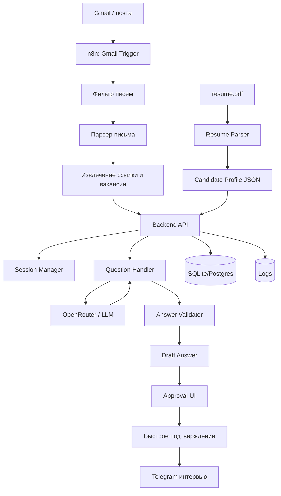

# ТЗ: простая система автоматизированной подготовки ответов на AI-интервью

## 1. Цель

Собрать **простую и быстро реализуемую систему**, которая:

- постоянно проверяет почту;
- находит письма-приглашения на AI-интервью;
- извлекает ссылку на интервью и название вакансии;
- использует резюме кандидата как основной источник фактов;
- быстро готовит короткие ответы в стиле Telegram;
- показывает готовый ответ в удобном интерфейсе;
- позволяет отправить ответ после быстрого подтверждения.

> Принцип проекта: **максимум автоматизации, минимум ручных действий, без сложной распределённой архитектуры**.

---

## 2. Что делаем в MVP

### Входит

- отслеживание новых писем;
- фильтрация писем от нужного отправителя;
- извлечение ссылки на интервью;
- загрузка и разбор `resume.pdf`;
- формирование краткого профиля кандидата;
- генерация ответов через LLM;
- простой UI для просмотра вопроса и готового ответа;
- логирование сессий и ответов.

### Не входит

- сложный микросервисный зоопарк;
- отдельная ML-инфраструктура;
- сложная аналитика;
- автоматическая отправка сообщений без контрольного шага;
- выдумывание фактов, которых нет в резюме.

---

## 3. Простая архитектурная идея

Система должна состоять всего из **4 основных частей**:

1. **n8n** — слушает почту и запускает сценарий.
2. **Небольшой backend** — хранит сессии, профиль кандидата и вызывает LLM.
3. **OpenRouter** — разбирает резюме и генерирует ответы.
4. **Лёгкий интерфейс подтверждения** — показывает вопрос и готовый ответ.

Такую систему реально быстро сделать и поддерживать.

---

## 4. Mermaid-диаграмма архитектуры



---

## 5. Блоки системы

## 5.1 n8n

Используется как простой оркестратор.

### Что делает

- слушает почту;
- реагирует на новые письма;
- фильтрует письма по отправителю и теме;
- отправляет данные в backend;
- создаёт уведомление пользователю.

### Почему именно n8n

- быстро собирается;
- почти без кода;
- удобно для Gmail + HTTP + уведомлений;
- легко дорабатывать.

---

## 5.2 Почтовый обработчик

### Функции

- проверить отправителя;
- достать тему письма;
- извлечь название вакансии;
- найти кнопку / ссылку на интервью;
- сохранить письмо в лог.

### Результат

Формируется объект:

```json
{
  "source_email": "hrplatform@sberbank.ru",
  "subject": "AI-интервью на вакансию ...",
  "vacancy_name": "...",
  "interview_url": "...",
  "received_at": "..."
}
```

---

## 5.3 Resume Parser

### Назначение

Один раз загружает `resume.pdf` и превращает его в удобный профиль.

### Выход

```json
{
  "full_name": "...",
  "current_role": "...",
  "skills": ["..."],
  "experience_summary": "...",
  "projects": ["..."],
  "education": ["..."],
  "english_level": "...",
  "salary_expectation": "...",
  "work_format": "...",
  "notice_period": "...",
  "must_not_claim": ["..."]
}
```

### Требования

- профиль должен редактироваться вручную;
- профиль должен храниться отдельно от резюме;
- профиль должен быть главным источником фактов.

---

## 5.4 Backend

Это небольшой сервис на Python FastAPI или Node.js.

### Что делает

- принимает события от n8n;
- хранит сессии интервью;
- подмешивает профиль кандидата;
- принимает вопрос;
- отправляет вопрос + профиль в LLM;
- получает ответ;
- валидирует ответ;
- сохраняет всё в базу.

### Основные модули

#### Session Manager
Хранит текущее состояние интервью.

#### Question Handler
Принимает вопрос и подготавливает контекст.

#### Answer Generator
Вызывает модель через OpenRouter.

#### Validator
Проверяет, что ответ:
- короткий;
- не выдумывает факты;
- не противоречит профилю;
- пригоден для отправки.

---

## 5.5 OpenRouter / LLM

### Использование

- разбор резюме;
- генерация ответов;
- приведение ответов к короткому Telegram-стилю.

### Требования к ответам

- 1–4 коротких предложения;
- без воды;
- без канцелярита;
- без неподтверждённых фактов;
- от первого лица.

---

## 5.6 Approval UI

Это должен быть **очень простой интерфейс**.

Подойдёт:
- маленький web-интерфейс;
- desktop-окно;
- Telegram-бот для самого пользователя;
- локальная панель в браузере.

### Что показывает UI

- название вакансии;
- текущий вопрос;
- предложенный ответ;
- кнопки:
  - `Отправить`
  - `Перегенерировать`
  - `Редактировать`
  - `Пропустить`

### Главная идея

Пользователь не пишет ответ сам с нуля, а только быстро подтверждает или слегка правит.

---

## 6. Данные

## 6.1 Candidate Profile

Основной объект профиля кандидата.

Поля:
- ФИО;
- текущая роль;
- опыт;
- стек;
- проекты;
- достижения;
- английский;
- зарплатные ожидания;
- формат работы;
- сроки выхода;
- стоп-список фактов.

---

## 6.2 Interview Session

```json
{
  "session_id": "uuid",
  "vacancy_name": "...",
  "interview_url": "...",
  "state": "new | active | waiting_approval | completed | failed",
  "created_at": "...",
  "updated_at": "..."
}
```

---

## 6.3 Question / Answer

```json
{
  "question": "...",
  "draft_answer": "...",
  "final_answer": "...",
  "status": "draft | approved | sent | rejected",
  "created_at": "..."
}
```

---

## 7. Основной сценарий работы

## Шаг 1. Ожидание письма

n8n постоянно ждёт новое письмо.

## Шаг 2. Обнаружение приглашения

Если письмо похоже на приглашение на интервью:
- сохраняем его;
- достаём ссылку;
- создаём новую сессию.

## Шаг 3. Подготовка контекста

Backend берёт:
- профиль кандидата;
- данные вакансии;
- ссылку на интервью.

## Шаг 4. Получение вопроса

Когда появляется вопрос из интервью, он передаётся в backend.

## Шаг 5. Генерация ответа

LLM получает:
- вопрос;
- профиль кандидата;
- правила стиля;
- запреты на выдумывание.

На выходе даёт черновик ответа.

## Шаг 6. Проверка

Validator проверяет ответ.

Если всё нормально — ответ показывается в UI.

## Шаг 7. Подтверждение

Пользователь нажимает `Отправить`.

## Шаг 8. Логирование

Вопрос, черновик, финальный ответ и статус сохраняются.

---

## 8. Минимальный стек

### Обязательное

- **n8n**
- **FastAPI** или **Node.js**
- **SQLite** на старте или **PostgreSQL**
- **OpenRouter API**
- **простая web-панель**

### Почему так

Это самый быстрый и недорогой путь к рабочему MVP.

---

## 9. Что именно нужно сделать в первой версии

## MVP v1

### 1. Почта
- подключить Gmail;
- фильтр по нужным письмам;
- извлечение ссылки.

### 2. Резюме
- загрузка PDF;
- генерация профиля кандидата;
- ручное редактирование профиля.

### 3. Backend
- API для создания сессии;
- API для генерации ответа;
- API для хранения логов.

### 4. Генерация
- system prompt;
- question prompt;
- ответ в JSON.

### 5. UI
- карточка вопроса;
- карточка ответа;
- кнопки подтверждения.

### 6. Логи
- письма;
- сессии;
- вопросы;
- ответы;
- ошибки.

---

## 10. Нефункциональные требования

### Надёжность
- не создавать дубль одной и той же сессии;
- повторно запускать обработку при ошибке;
- сохранять все важные шаги.

### Скорость
- стартовая подготовка после письма: до 10–20 секунд;
- генерация одного ответа: до 3–7 секунд.

### Простота
- минимум сервисов;
- минимум инфраструктуры;
- минимум ручной настройки.

### Поддерживаемость
- вся конфигурация через `.env`;
- промпты хранить отдельно;
- логи и состояния хранить в базе.

---

## 11. Риски

### 1. Письмо может изменить формат
Решение:
- парсить и HTML, и текст;
- иметь fallback-режим.

### 2. Резюме может быть неполным
Решение:
- дать пользователю вручную дополнять профиль.

### 3. LLM может выдумывать
Решение:
- использовать только Candidate Profile;
- валидировать ответ;
- не отправлять без контрольного шага.

### 4. Вопрос может быть нестандартным
Решение:
- fallback-ответ;
- ручная правка в UI.

---

## 12. Правила генерации ответа

LLM должна соблюдать правила:

1. Отвечать только на основе профиля кандидата.
2. Не выдумывать опыт и достижения.
3. Писать кратко и естественно.
4. Писать от первого лица.
5. Не использовать слишком длинные абзацы.
6. Если информации не хватает — помечать ответ как требующий правки.

---

## 13. Критерии готовности MVP

Система считается готовой, если:

1. Она ловит новое письмо-приглашение.
2. Она извлекает ссылку и вакансию.
3. Она умеет один раз разобрать резюме в профиль.
4. Она умеет принимать вопрос и строить ответ.
5. Она показывает ответ в UI.
6. Она хранит историю сессии.
7. Она остаётся достаточно простой, чтобы один разработчик мог быстро её собрать и поддерживать.

---

## 14. Рекомендуемый порядок реализации

### Этап 1
- резюме → profile JSON;
- backend + OpenRouter;
- генерация ответов вручную через UI.

### Этап 2
- подключение почты через n8n;
- автообнаружение приглашений;
- автоматическое создание сессий.

### Этап 3
- улучшение UI;
- журналирование;
- retry;
- удобные шаблоны ответов.

---

## 15. Итоговое архитектурное решение

Для быстрой реализации рекомендуется следующий финальный вариант:

- **n8n** — ловит письмо и запускает процесс;
- **backend** — управляет логикой;
- **OpenRouter** — разбирает резюме и генерирует ответы;
- **SQLite/Postgres** — хранит профиль, сессии и логи;
- **простой UI** — показывает ответ и даёт его быстро подтвердить.

Это **не перегруженная архитектура**, а практичный MVP, который можно быстро собрать и потом постепенно улучшать.
